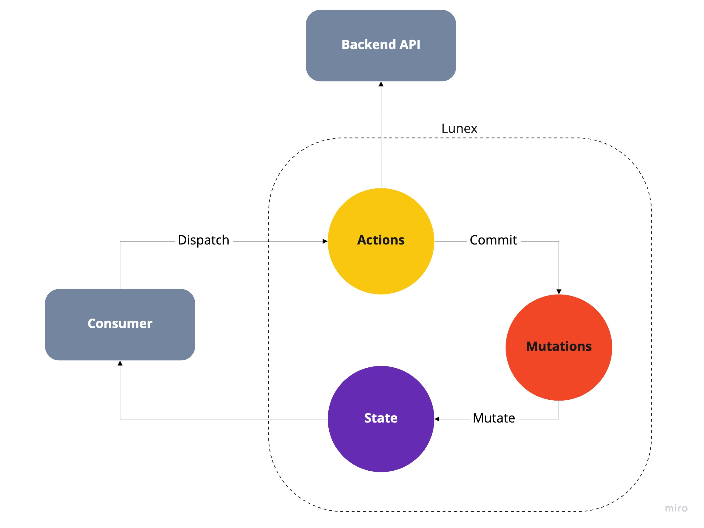

# Lunex

Lunex is a lightweight, framework agnostic, state management **library** based on the [Vuex state management pattern](https://vuex.vuejs.org/#what-is-a-state-management-pattern).

## Installation

```sh
yarn add lunex
```

```sh
npm install lunex
```

## Core Concepts

[Vuex's official documenation](https://vuex.vuejs.org/#what-is-a-state-management-pattern) does a great job of outlining the core concepts and reasoning behind the state management pattern. In short, shared state within an application is contained within a store. Consumers can subscribe to the value of the state, commit [mutations](https://vuex.vuejs.org/guide/mutations.html) on the state synchronously, or dispatch [actions](https://vuex.vuejs.org/guide/actions.html) to perform mutations based on the result of asynchronous logic. 


